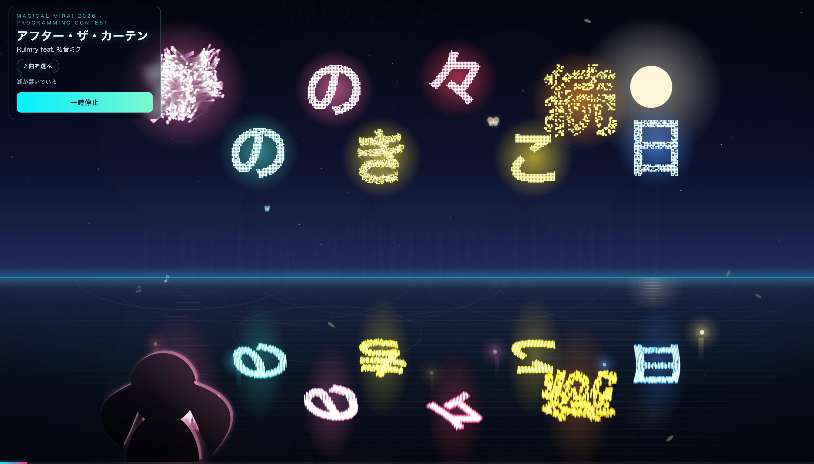

# 湖のソナーレ — Sonare of the Lake

初音ミク「マジカルミライ 2026」プログラミング・コンテスト 応募作品



夜の湖を舞台にしたリリックアプリです。曲が流れると、歌詞のひと文字ずつが花火になって湖から打ち上がり、水面に映ります。ただ眺めるだけにせず、画面にふれると湖が反応するようにしました。


## 作ったきっかけ

今年のマジカルミライのテーマが「湖のソナーレ」だと知って、湖と花火と歌詞を組み合わせたら気持ちのいい映像になりそうだ、と思ったのが始まりです。「ソナーレ」は響く、という意味の言葉なので、見ている人のタップが演出に響いて返ってくる、参加できるライブにしたいと思いながら作りました。

## 見どころ

**歌詞が花火になる**
曲が進むと、歌詞が湖から打ち上がって夜空で光の粒になって散ります。テンポの速い曲では花火も大きく、数も増えます。

**水面に映る**
花火や月あかりが湖面にゆれて映ります。さわると波紋も広がって、夜の水辺の雰囲気を出しました。

**ふれて反応する**（ここが一番こだわった所です）
- 水面にふれる → 波紋が広がる
- 岸辺のミクにふれる → ミクの花火が上がる
- 歌詞にふれる → その言葉が響く

**タップが最後に効いてくる**
演奏中にたくさんふれるほど湖にエネルギーがたまって、最後のサビで大きなフィナーレになります。あまりふれなければ静かに終わるので、観客のノリで結末が少し変わります。

ほかにも、ビートやサビ、音の大きさにあわせて色や明るさが変化します。課題曲6曲すべてに対応していて、和太鼓みたいな曲選び画面から選べます。PC・タブレット・スマホのどれでも、画面サイズにあわせて動きます。

## 動作環境

- PC ・ タブレット ・ スマートフォン
- ブラウザ: Chrome / Safari / Edge（新しめのもの）
- インターネット接続が必要です（TextAlive で曲と歌詞を読み込むため）
- 音を出して楽しんでください

## 遊び方

1. 画面をタップ（クリック）して始める
2. 「曲を選ぶ」から曲を選ぶ（「次の曲」でも切り替えできます）。曲のカードを押すとスタートします
3. 演奏中は、水面・岸辺のミク・歌詞にふれてみてください。たくさんふれると最後が派手になります

## 動かし方（開発者向け）

index.html ひとつだけで動く静的アプリです。ビルドは要りません。画像も全部 index.html の中に埋め込んであります。

TextAlive を使う都合で file:// だと動かないので、簡単な HTTP サーバ経由で開いてください。

```bash
python -m http.server 8000   # または python3 -m http.server 8000
```

あとはブラウザで http://localhost:8000/ を開けば動きます。

## 使った技術

TextAlive App API（歌詞と曲の同期）と HTML5 Canvas で描いています。フレームワークは使わず、素の JavaScript で書きました。

## 課題曲

| # | 曲名 | アーティスト |
|---|------|------------|
| 1 | TAKEOVER | Twinfield feat. 初音ミク |
| 2 | こたえて | imie feat. 初音ミク |
| 3 | アフター・ザ・カーテン | Rulmry feat. 初音ミク |
| 4 | シャッターチャンス | 夜未アガリ feat. 初音ミク、鏡音リン |
| 5 | 世界最後の音楽隊 | 夏山よつぎ×ど～ぱみん feat. 初音ミク |
| 6 | トリツクロジー | 鶴三 feat. 初音ミク |

## クレジット

- 楽曲: 上記アーティストの皆さま
- 初音ミク・鏡音リン © Crypton Future Media, INC. (www.piapro.net)
- TextAlive App API: 産業技術総合研究所
- 制作: Lau Kai Kwan


湖のほとりで、音楽と光をゆっくり楽しんでもらえたら嬉しいです。

---

初音ミク「マジカルミライ 2026」プログラミング・コンテスト 応募作品
